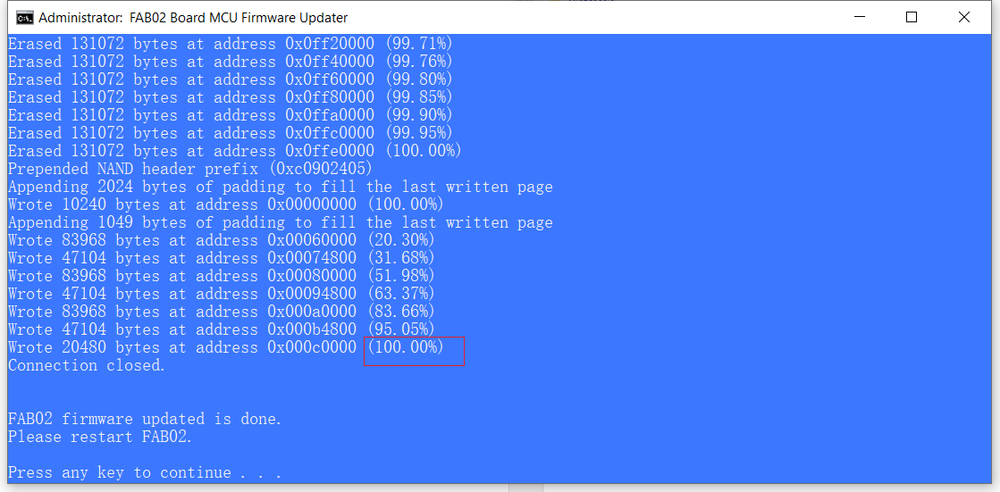
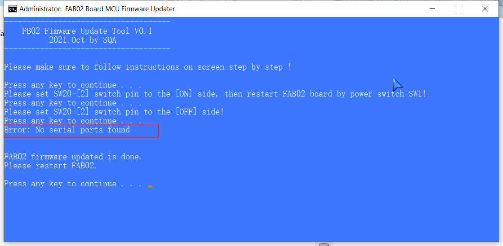
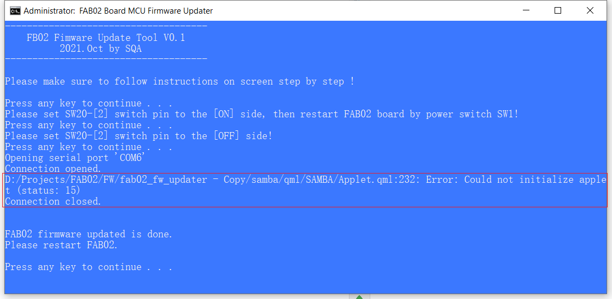

### **Read Me**

*This firmware updater tool is for MCU (ATSAMA5D2) on FAB02 only.*

1. The **boot.bin** is MCU bootloader. And you can replace it by new version file, but need to keep same name.

2. The **app.bin** is the application bin file. And you can replace it by new version file, but need to keep same name.

3. Execute **Run.bat** to start. Please make sure to follow instructions on screen step by step !

4. You can see the following information on screen if the firmware was updated successfully. And the update operation will cost about 20 seconds normally. 
   

5. The execution will stop in a short time if any error hit: 

- 5.1 If you see error like this, means the firmware update failed. Please check if FAB02 board USB is connected to PC, or  if SW20-[2] is switched to [ON].

- 5.2 If you see error like this, means the firmware update failed. Please check if FAB02 board USB is connected to PC, or  if SW20-[2] is switched to [OFF] after restart board.

